# Récapitulatif - Git et SourceGit

## Sommaire
- [Récapitulatif - Git et SourceGit](#récapitulatif---git-et-sourcegit)
  - [Sommaire](#sommaire)
  - [Introduction](#introduction)
  - [Première mise en place](#première-mise-en-place)
    - [Cloner le repo](#cloner-le-repo)
    - [Configurer le repo](#configurer-le-repo)
  - [Suivi des fichiers](#suivi-des-fichiers)
    - [Ajouter un fichier au suivi](#ajouter-un-fichier-au-suivi)
      - [Dans SourceGit](#dans-sourcegit)
      - [Avec l'outil CLI](#avec-loutil-cli)
    - [Créer un commit](#créer-un-commit)
      - [Dans SourceGit](#dans-sourcegit-1)
      - [Avec l'outil CLI](#avec-loutil-cli-1)
    - [Supprimer un fichier suivi par Git en le conservant localement](#supprimer-un-fichier-suivi-par-git-en-le-conservant-localement)
      - [Avec l'outil CLI](#avec-loutil-cli-2)
  - [Travailler avec l'historique](#travailler-avec-lhistorique)
    - [Visualiser l'historique](#visualiser-lhistorique)
      - [Dans SourceGit](#dans-sourcegit-2)
      - [Avec l'outil CLI](#avec-loutil-cli-3)
    - [Afficher les détails d'un commit spécifique](#afficher-les-détails-dun-commit-spécifique)
      - [Dans SourceGit](#dans-sourcegit-3)
      - [Avec l'outil CLI](#avec-loutil-cli-4)
  - [Branches](#branches)
    - [Créer une nouvelle branche](#créer-une-nouvelle-branche)
      - [Dans SourceGit](#dans-sourcegit-4)
      - [Avec l'outil CLI](#avec-loutil-cli-5)
    - [Lister les branches](#lister-les-branches)
      - [Dans SourceGit](#dans-sourcegit-5)
      - [Avec l'outil CLI](#avec-loutil-cli-6)
    - [Changer de branche active](#changer-de-branche-active)
      - [Dans SourceGit](#dans-sourcegit-6)
      - [Avec l'outil CLI](#avec-loutil-cli-7)
    - [Fusionner une branche souhaitée dans la branche active](#fusionner-une-branche-souhaitée-dans-la-branche-active)
      - [Dans SourceGit](#dans-sourcegit-7)
      - [Avec l'outil CLI](#avec-loutil-cli-8)
    - [Récupérer un commit spécifique d'une autre branche et le copier sur la branche active](#récupérer-un-commit-spécifique-dune-autre-branche-et-le-copier-sur-la-branche-active)
      - [Dans SourceGit](#dans-sourcegit-8)
      - [Avec l'outil CLI](#avec-loutil-cli-9)
    - [Résoudre des conflits de fusion post-merge ou pull](#résoudre-des-conflits-de-fusion-post-merge-ou-pull)
      - [Dans SourceGit](#dans-sourcegit-9)
      - [Avec l'outil CLI](#avec-loutil-cli-10)
  - [Travailler avec un repo distant](#travailler-avec-un-repo-distant)
    - [Tirer les changements du repo distant (pull)](#tirer-les-changements-du-repo-distant-pull)
      - [Dans SourceGit](#dans-sourcegit-10)
      - [Avec l'outil CLI](#avec-loutil-cli-11)
    - [Récupérer l'historique des commits de toutes les branches sans les télécharger (fetch)](#récupérer-lhistorique-des-commits-de-toutes-les-branches-sans-les-télécharger-fetch)
      - [Dans SourceGit](#dans-sourcegit-11)
      - [Avec l'outil CLI](#avec-loutil-cli-12)
    - [Pousser les changements sur le repo distant (push)](#pousser-les-changements-sur-le-repo-distant-push)
      - [Dans SourceGit](#dans-sourcegit-12)
      - [Avec l'outil CLI](#avec-loutil-cli-13)
  - [Workflow général](#workflow-général)
  - [Bonnes pratiques](#bonnes-pratiques)


## Introduction
Cette fiche récapitulative a pour but de présenter l'essentiel des opérations que l'on sera amenés à faire durant le PTUT. Elles seront présentées avec l'outil GUI SourceGit, couplées à leur équivalent avec l'outil CLI.

Je conseille de travailler avec l'interface de SourceGit en anglais, car certains termes francisés des différents process Git rendent les choses plus complexes à retenir. De plus, si vous voulez aller chercher de la documentation sur le sujet, vous la trouverez le plus souvent en anglais. (comme tout...)

## Première mise en place
### Cloner le repo
Pour cloner le repo, je conseille d’utiliser l’outil CLI de git ; cela peut éviter les soucis étant donné que l’on clone avec une adresse SSH.

Pour cloner le repo, taper ceci : 
```bash
git clone git@github.com:Greta-Ardeche-Drome/wizards-n-dices.git
```

### Configurer le repo
Configurer le repo cloné veut dire ici la spécification de l’utilisateur et de l’adresse e-mail poussés avec un commit.
```bash
git config user.name "Prénom NOM"
git config user.email "adresse@mail.org"
```

## Suivi des fichiers
### Ajouter un fichier au suivi
#### Dans SourceGit
Cliquer sur "Changes", vous basculez dans une nouvelle fenêtre où vous voyez la liste des changements.
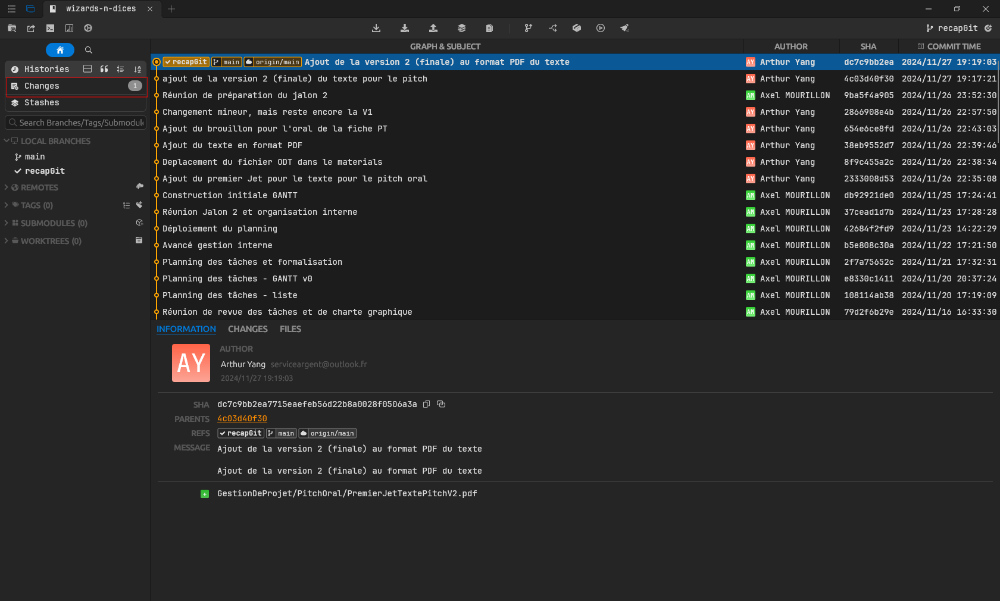

On ajoute les changements que l'on veut à l'index en cliquant dessus ou en cliquant sur l'icône mise en évidence ci-dessous, ce qui ajoute tous les changements non indexés à l'index. En anglais, l'index s'appelle le "stage".
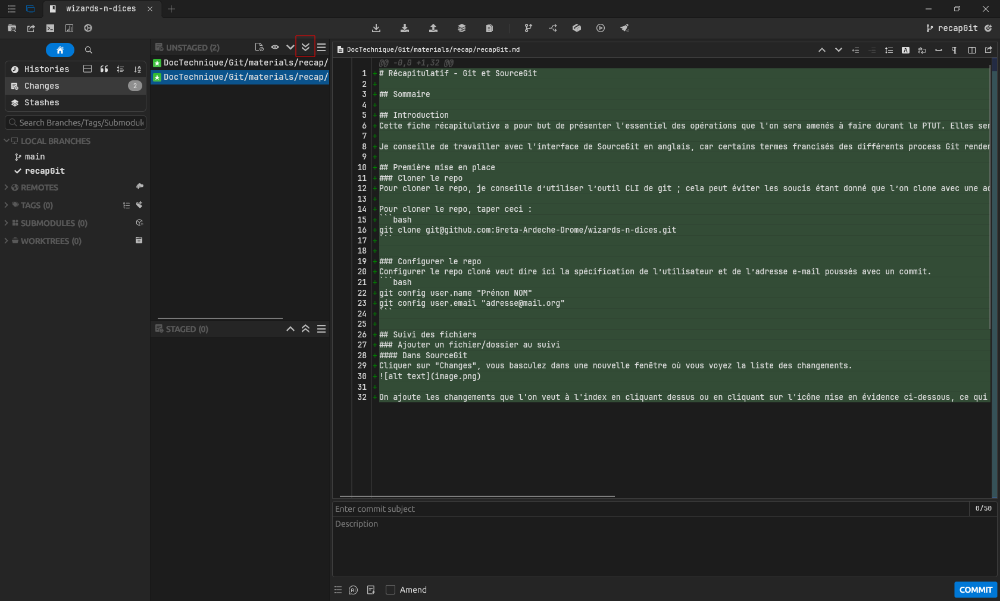

Rappelez-vous qu'on ne peut pas ajouter un dossier vide à l'index, il est obligatoire de créer un fichier dans le dossier en question pour qu'il apparaisse dans le repo distant.

#### Avec l'outil CLI
Ajouter un certain fichier au suivi :
```bash
git add chemin/vers/le/fichier
```

Ajouter tous les changements non indexés à l'index :
```bash
git add .
```

### Créer un commit
#### Dans SourceGit
Une fois les changements indexés, on crée un commit pour sauvegarder leur état dans l'historique du repo. Dans la fenêtre "Changes", il y a un espace pour créer un message de commit avec titre et description. La description n'est pas obligatoire.
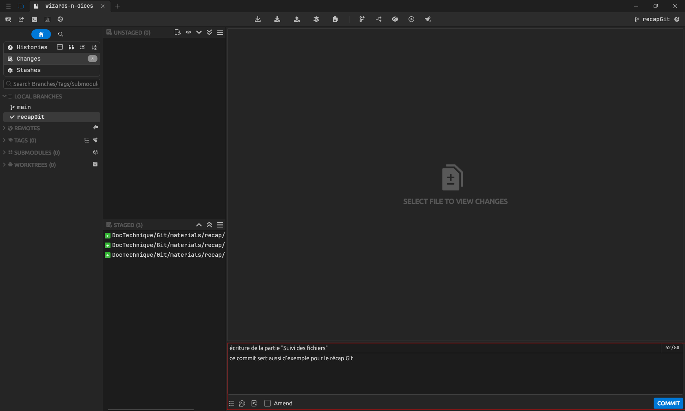

Une fois le message écrit, il suffit de cliquer sur "Commit". En revenant dans la fenêtre "Histories", le commit apparaît dans l'historique.


#### Avec l'outil CLI
```bash
git commit -m "message de commit"
```

### Supprimer un fichier suivi par Git en le conservant localement
Par soucis de simplicité, ce genre d'opération sera à effectuer en mode CLI uniquement.

#### Avec l'outil CLI
```bash
git rm --cached <chemin-du-fichier>
```

## Travailler avec l'historique
### Visualiser l'historique
#### Dans SourceGit
L'interface de SourceGit, et de n'importe quel autre outil GUI d'ailleurs, a comme fenêtre principale l'historique en "graph" et synthétise les infos de chaque commit en une ligne.

#### Avec l'outil CLI
Affichage classique :
```bash
git log
```

Affichage plus compact :
```bash
git log --oneline
```

Affichage en "graph" :
```bash
git log --graph
```

Affichage en "graph" plus compact (plus proche de l'interface SourceGit) :
```bash
git log --graph --oneline
```

Exemple :
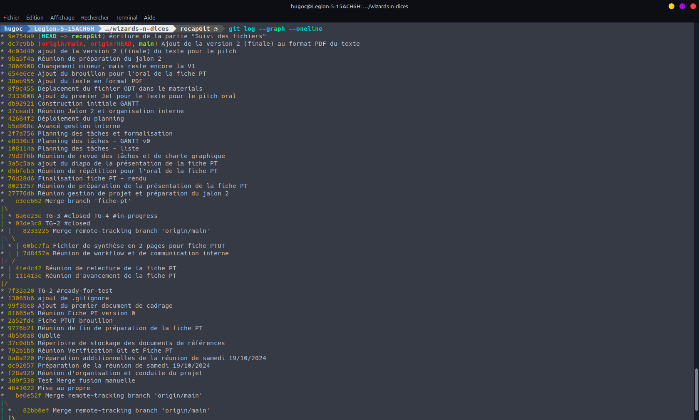

### Afficher les détails d'un commit spécifique
#### Dans SourceGit
Cliquer sur un commit permet de voir plusieurs informations, séparées en trois onglets : les infos générales et les changements.
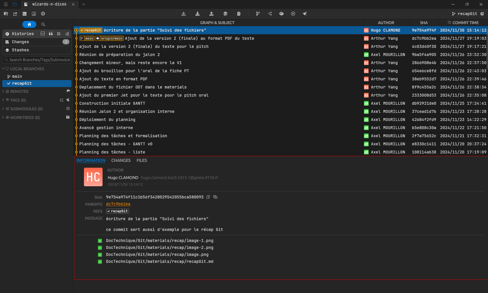

Les infos générales regroupent la plupart des infos que l'on souhaite récupérer d'un coup d'œil, à savoir :
- les infos sur l'auteur du commit,
- les branches sur lesquelles est le commit,
- le message de commit,
- les changements des fichiers liés au commit.

#### Avec l'outil CLI
Une commande, parmi d'autres, d'obtenir des infos sur un commit en particulier, est la suivante :
```bash
git show <commit-id>
```
où le `<commit-id>` correspond au hash du commit visé.

## Branches
### Créer une nouvelle branche
#### Dans SourceGit
Cliquer sur un commit pour l'avoir en surbrillance dans l'historique, cliquer sur l'icône mise en évidence :
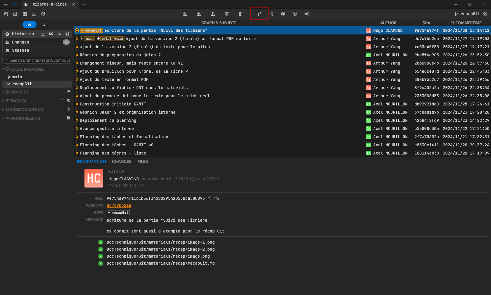

**ATTENTION :** Committez vos changements avant de "checkout"(= vous placer) sur votre branche nouvellement créée. Git vous donnera un message d'erreur vous disant que vous ne pourrez pas forcément changer de branche avant d'avoir mis vos changements dans un commit ou autre.

#### Avec l'outil CLI
```bash
git branch <nom-de-la-branche>
```

Ou en créant et basculant dessus immédiatement :
```bash
git checkout -b <nom-de-la-branche>
```

### Lister les branches
#### Dans SourceGit
On peut voir les branches du repo, locales et distantes, dans la partie mise en évidence de la capture d'écran ci-dessous. 
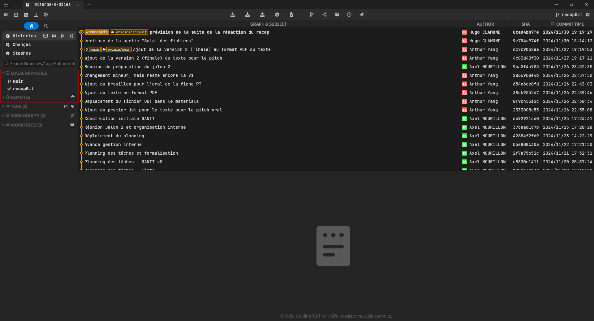

#### Avec l'outil CLI
```bash
git branch
```

### Changer de branche active
#### Dans SourceGit
Pour basculer sur une branche souhaitée, il suffit de double cliquer sur la branche souhaitée dans la partie de l'interface où l'on peut les visualiser (cf. section précédente).

**ATTENTION :** Committez vos changements avant de basculer sur une branche. Git vous donnera un message d'erreur vous disant que vous ne pourrez pas forcément changer de branche avant d'avoir mis vos changements dans un commit ou autre.

#### Avec l'outil CLI
```bash
git checkout <nom-de-la-branche>
# OU :
git switch <nom-de-la-branche
```

### Fusionner une branche souhaitée dans la branche active
Quel que soit l'outil que vous utilisez, vous devez d'abord basculer sur la branche dans laquelle vous souhaitez effectuer un "merge" (= fusion).

#### Dans SourceGit
Faites un clic droit sur la branche que vous souhaitez fusionner dans la branche actuelle, puis "Merge <branche-visée> into <branche-actuelle>"

#### Avec l'outil CLI
```bash
git merge <nom-de-la-branche-souhaitée>
```

### Récupérer un commit spécifique d'une autre branche et le copier sur la branche active
Cette manipulation s'appelle le cherry-pick. Bien qu'il puisse s'agir d'une manipulation plutôt avancée, je choisis d'en parler car il peut être intéressant de récupérer un commmit spécifique d'une autre branche ayant évolué en parallèle de votre branche actuelle, sans pour autant faire un merge de toute l'autre branche.

Cela peut être utile si, par exemple, en étant sur votre branche actuelle, qu'on va nommer "A", vous voulez récupérer le commit n°1 de la branche B, mais que le commit n°2 introduit un bug que vous ne voulez pas.

#### Dans SourceGit
En étant dans votre branche actuelle, sélectionnez un commit d'une autre branche ayant évolué en parallèle. Faites clic droit, puis "Cherry-pick this commit".
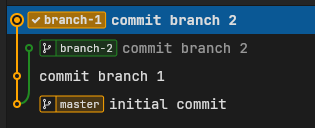

La capture d'écran montre que, sur un repo de démonstration, le cherry-pick a copie le commit de la branch "branch-2" dans la branche "branch-1".

*Note* : Si vous faites cherry-pick d'un commit qui a été réalisé avant votre dernier commit présent sur votre branche actuelle, il se place alors avant votre dernier commit sur votre branche. Par ailleurs, si vous prenez un commit d'une autre branche qui a déjà plusieurs commmits avant lui, alors il copiera également les commits qui ont été réalisés avant, dans votre branche actuelle.

**ATTENTION** : un cherry-pick peut, au même titre qu'un merge, provoquer des conflits de fusion. Voir la section [Résoudre des conflits de fusion post-merge ou pull](#résoudre-des-conflits-de-fusion-post-merge-ou-pull)

#### Avec l'outil CLI
Tout d'abord, récupérer le hash du commit souhaité. Ensuite :
```bash
git cherry-pick <hash-du-commit>
```

### Résoudre des conflits de fusion post-merge ou pull
Je vais montrer une situation simple de conflit de fusion, où deux branches ont réalisé le même changement, ici un readme.md. Les deux branches, "branch-1" et "branch-2", ont modifié la ligne 2 du fichier. On va voir comment résoudre le conflit. Ici, on veut récupérer les changements des deux côtés. Il existe des cas où l'on ne voudra récupérer que les changements d'un côté, où quelques changements de l'un et de l'autre.

#### Dans SourceGit
Dans notre exemple (toujours sur un repo de démonstration), on se place sur la branche "master", puis on commence par fusionner les changements de la branche "branch-1" dans la branche "master".
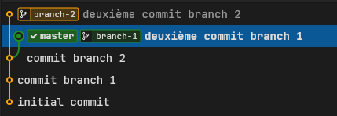

Puis on réaliser un autre merge, de la "branch-2" vers la "master". Un bandeau s'affiche pour indiquer qu'il y a conflit. On clique alors sur "Resolve".
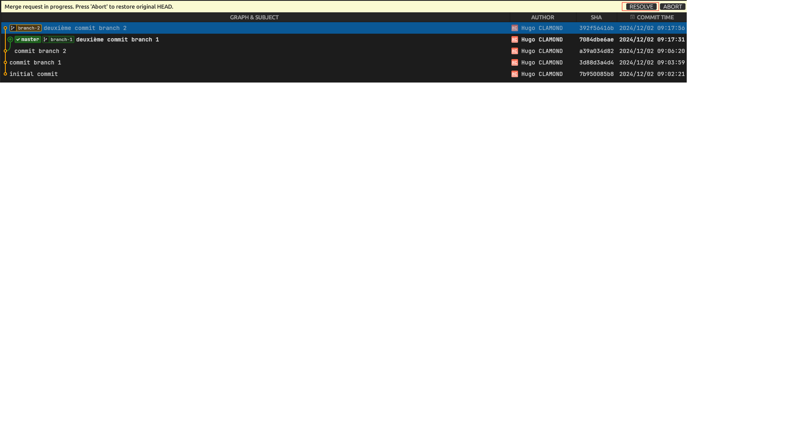

D'ici, on fait un clic droit sur le changement en conflit, représenté sur SourceGit par une icône rouge contenant un point d'exclamation. Puis on sélectionne "Open external merge tool". Si vous avez bien configuré votre SourceGit, ça devrait ouvrir VSCode sur le fichier en question.
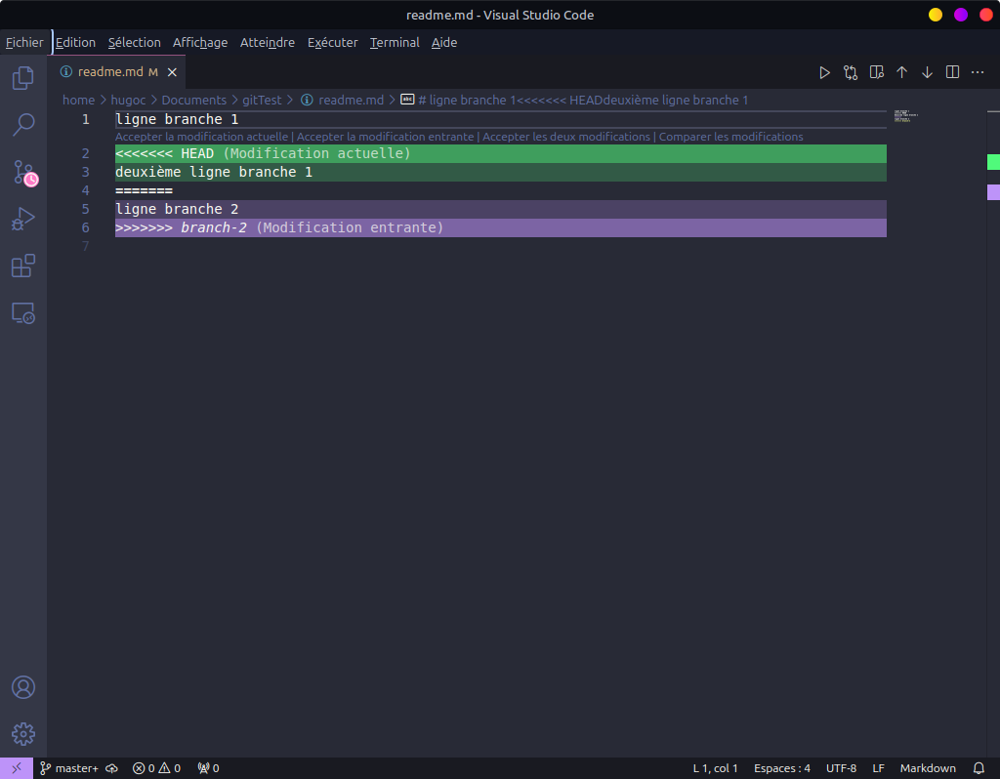

D'ici, on clique sur "Résoudre dans l'éditeur de fusions", et on arrive sur la capture d'écran suivante.
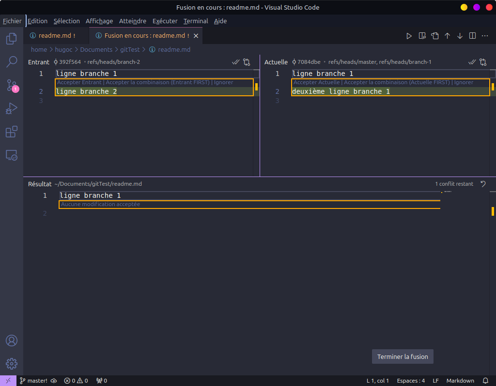

Vu qu'on souhaite récupérer les changements des deux côtés, on clique sur le texte cliquable "Accepter Actuelle", puis sur "Accepter Entrante". Le résultat est le suivant :
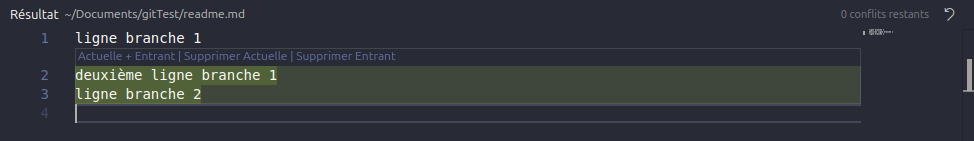

On clique sur le bouton "Terminer la fusion", **puis on ferme la fenêtre de VSCode qui s'est ouverte.** Cette étape est très importante pour que SourceGit détecte que l'on a fini de travailler sur le conflit.

De retour dans SourceGit, on clique sur "Continue".
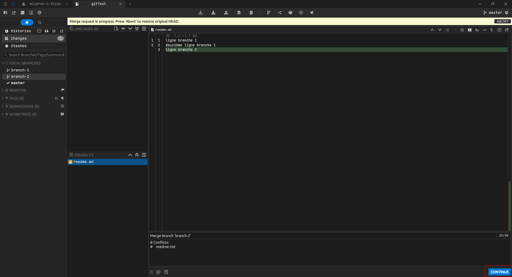

L'historique ressemble maintenant à ça :

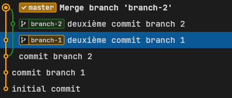

#### Avec l'outil CLI
```bash
git merge <nom-de-la-branche-souhaitée>
```

Vous verrez quelque chose de ce genre :
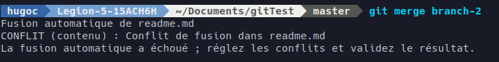

Ouvrez alors VSCode sur le fichier qui est en conflit de fusion. De là, suivez les mêmes étapes que si vous faisiez avec SourceGit.

Une fois le conflit résolu, faites un commit puis visualisez le changement.


## Travailler avec un repo distant
### Tirer les changements du repo distant (pull)
#### Dans SourceGit
Cliquez sur l'icône mise en évidence sur la capture d'écran :


Cette petite fenêtre s'ouvre, faites bien attention à ce que les réglages soient les mêmes que sur la capture d'écran :
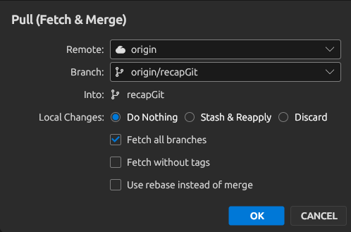

#### Avec l'outil CLI
```bash
git pull
```

### Récupérer l'historique des commits de toutes les branches sans les télécharger (fetch)
#### Dans SourceGit
Cliquez sur l'icône mise en évidence sur la capture d'écran :


Une autre fenêtre s'ouvre, laissez tout par défaut.

#### Avec l'outil CLI
```bash
git fetch --all
```

### Pousser les changements sur le repo distant (push)
Quoi qu'il arrive, vous devez effectuer cette opération après avoir fait un pull ou un fetch, et vous devez avoir réalisé un commit.

#### Dans SourceGit
Cliquez sur l'icône mise en évidence sur la capture d'écran :
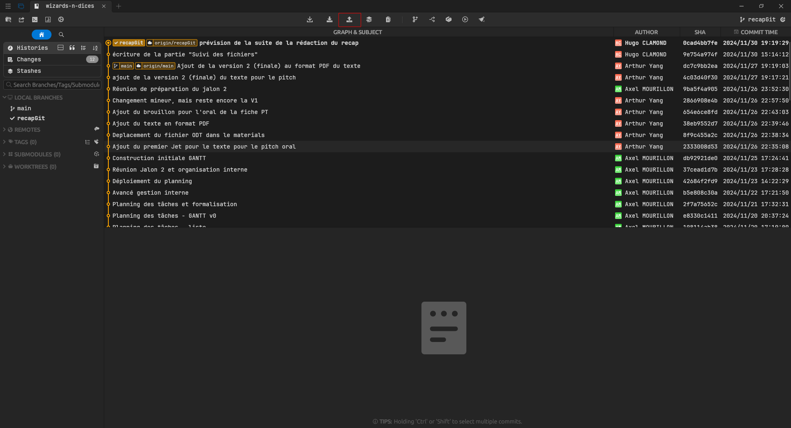

**ATTENTION** : Ne **JAMAIS** cocher la case Force push.

#### Avec l'outil CLI
```bash
git push
```

## Workflow général
- Lorsque l'on travaille sur quelque chose (ici le récap sur Git), on crée une branche nommée après ce sur quoi on travaille (ici recapGit). Une fois notre travail terminé et prêt à être rendu dans la branche stable, on fait un merge vers la branche "main. Une fois le merge terminé, on supprime la branche. (Clic droit sur la branche > "Delete <nom-de-la-branche>". Cocher "Also remove remote branch <nom-de-la-branche-distante>".)
- Lorsque l'on veut commencer à travailler sur quelque chose en particulier, on part du dernier commit de la branche "main" et on crée la branche à partir de ce dernier commit.
- On évite de travailler directement sur la main, sauf pour pousser les compte-rendus de réunion.

## Bonnes pratiques
- Je fais régulièrement des commits durant mon avancée sur mon travail.
- Je garde les messages de commit clairs et concis. On doit pouvoir savoir directement ce sur quoi j'ai travaillé en lisant le message de commit.
- Je supprime les branches obsolètes après un merge pour garder le repo propre.
- J'utilise des noms de branche explicites, par exemple :
  - `fix-affichage-images`
  - `feature-ajout-tableau`
  - `doc-update-recap-git`
- Avant de pousser, je m'assure que le code fonctionne et a été testé. Si des tests automatisés sont en place, je vérifie qu'ils passent tous. Si je sais que le code ne fonctionne pas mais que je dois pousser malgré tout, je le marque dans mon message de commit.
- Si des conflits de fusion se présentent, je prends le temps de les résoudre avec attention, pour éviter les pertes de données accidentelles.
- Si je veux garder un fichier dans le repo mais que je ne veux pas que Git le prenne en compte, je le mets dans le dossier `_fichiers_temporaires`. Au besoin, j'ajoute des dossiers ou des fichiers à ignorer dans `.gitignore`.
- Contacter le responsable technique avant d'éditer le fichier `.gitignore`.
- Contacter le responsable technique en cas de doute sur l'utilisation de Git.